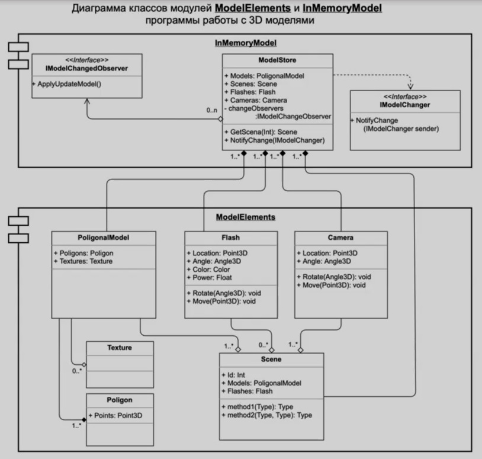

# `Домашнее задание 1`

## `Задача:`
На основе Диаграмы классов ModelElements, разработать классы: Model Store, PoligonalModel (Texture, Poligon), Flash, Camera, Scene

## `Описание решения:`
Для решения данной задачи использовась диаграмма классов, представленная на схеме:
.

В ходе выполнения проекта были внесены следующие уточнения, не отмеченные на UML-диаграмме:
* назначен модификаторы доступа *private* для всех полей у всех классов, реализованы механизмы инкапсуляции;
* добавлены методы добавления, удаления и редактирования свойств для экземпляров классов Scene, PolygonalModel, Polygon, Camera, Flash 

## `Результаты:`
В результате работы реализованы две компоненты *InMemoryModel* и *ModelElements* в соответствии с UML-диаграммой задания.
Компонента ModelElements содержит основные элементы и методы для работы с ними.
Компонента InMemoryModel содержит класс ModelStore для работы со сценами и их элементами, а также интерфейс IModelChangedObserver для взаимодействия с внешними компонентами или программами.

## `Что можно улучшить:`
* в классе текстуры реализовать механизм загрузки и хранения изображения по ссылке
* из диаграммы не понятно, что передается в качестве параметра в методе NotifyChange(IModelChanger sender).
