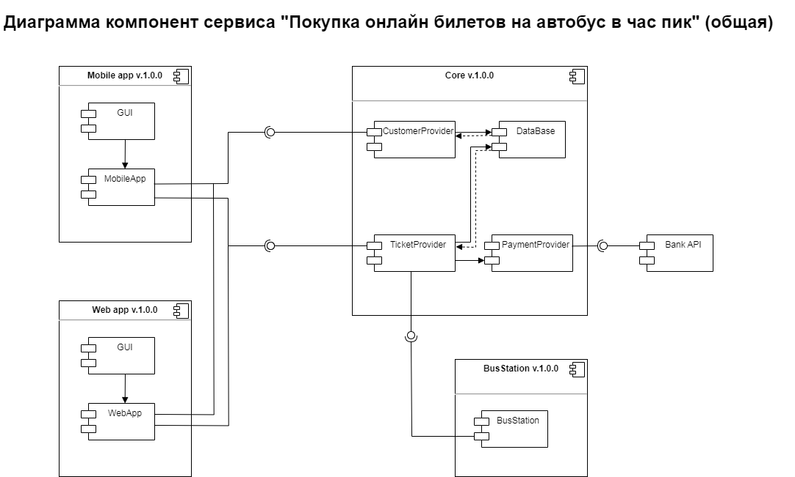

# `Домашнее задание 4`

## `Задача:`
Разработать контракты и компоненты системы "Покупка онлайн билетов на автобус в час пик".

1.  Предусловия.
2.  Постусловия.
3.  Инвариант.
4.  Определить абстрактные и конкретные классы.
5.  Определить интерфейсы.
6.  Реализовать наследование.
7.  Выявить компоненты.
8.  Разработать Диаграмму компонент использую нотацию UML 2.0. Общая без деталей.

## `Описание решения:`

UML-диаграмма классов для системы "Покупка онлайн билетов на автобус в час пик" представлена на схеме:
  

